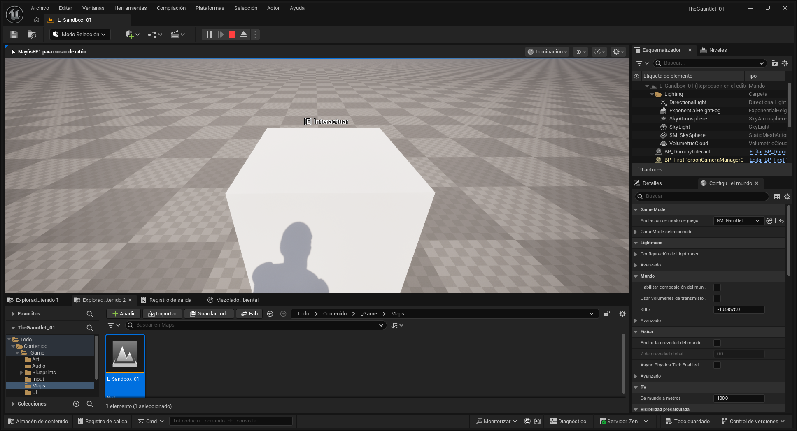

# 🏛️ The Sentinel's Path (Nombre del Juego)
> *Un puzle de lógica y perspectiva en primera persona desarrollado para "The Gauntlet: UE5 Survivor Jam".*

ScreenShot del Día 1 de la JAM ♥♥

---

## 🎮 Sobre el Juego
**The Sentinel's Path** es una experiencia de puzles atmosférica donde el jugador debe manipular estatuas antiguas para alinear haces de luz y abrir portales a dimensiones desconocidas. Cada nivel introduce nuevas mecánicas sobre la base de la orientación espacial y la lógica secuencial.

*   **Género:** Puzzle / First Person / Logic
*   **Motor:** Unreal Engine 5.7
*   **Estado:** Prototipo Funcional (Post-Jam)

---

## 🕹️ Controles
| Acción | Input (Teclado/Mouse) |
| :--- | :--- |
| **Moverse** | W, A, S, D |
| **Mirar** | Mouse |
| **Interactuar / Rotar** | E |
| **Saltar** | Espacio |
| **Reiniciar Nivel** | R |
| **Salir** | ESC |

---

## 🛠️ Instalación y Ejecución
Para jugar la versión compilada (Windows):
1.  Ve a la sección de **[Releases](https://github.com/TuUsuario/TuRepositorio/releases)** (a la derecha en GitHub).
2.  Descarga el archivo `.zip` de la última versión.
3.  Descomprime la carpeta.
4.  Ejecuta `TheSentinelsPath.exe`.

---

## 👨‍💻 Para Desarrolladores (Cómo abrir el proyecto)
Si quieres inspeccionar el código o los Blueprints:
1.  Clona este repositorio: `git clone https://github.com/TuUsuario/TuRepositorio.git`
2.  Asegúrate de tener instalado **Unreal Engine 5.7**.
3.  Haz clic derecho en `TheSentinelsPath.uproject` y selecciona **"Generate Visual Studio project files"**.
4.  Abre el archivo `.uproject`.

### 🧩 Estructura Técnica
*   **Core Mechanics:** Implementadas en Blueprints (`BP_StatueMaster`, `BP_PuzzleManager`).
*   **Interaction:** Interface-based system (`BPI_Interact`).
*   **Plugins:** Enhanced Input System (Nativo).

---

## 🏆 Historial de "The Gauntlet Jam"
Este proyecto fue desarrollado en 7 días bajo estrictas reglas de eliminación diaria.
*   **Día 1:** Locomoción y Repo ✅ !(Docs\BITÁCORA TÉCNICA - DÍA 1.txt)
*   **Día 2:** Mecánica Base (Rotación) ✅
*   **Día 3:** Game Loop (Win/Lose) ✅
*   **Día 4:** Level Design (Greybox) ✅
*   **Día 5:** Arte y Atmósfera (Lumen/Nanite) ✅
*   **Día 6:** UI y Audio ✅
*   **Día 7:** Build Final y Optimización ✅

---

## 📄 Créditos y Licencia
*   **Desarrollo:** Mauricio José Tobares
*   **Assets 3D:** Quixel Megascans / Fab
*   **Sonido:** Freesound.org
*   **Licencia:** Este proyecto se distribuye bajo la licencia MIT. Eres libre de usar el código para aprendizaje.

---
*Hecho con ❤️ y café durante The Gauntlet Jam 2025.*
